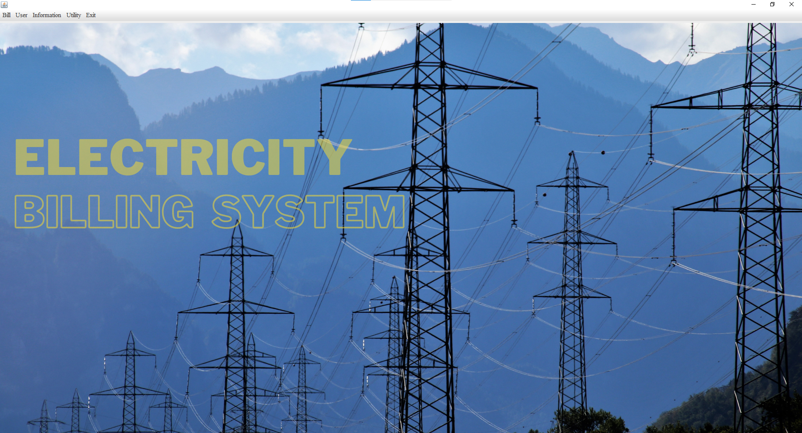

# Electricity Billing System

## Overview
This is an Electricity Billing System built using Java 17 with Swing for the GUI, JDBC for database connectivity, and libraries like bcrypt, bytes, and rs2xml. The system has two modes: admin and customer. The admin can register customers, set billing amounts, and view customer and deposit details. Customers can register in the system to pay their electric bills, print receipts, and check the amount due. Customers can also generate invoices, pay or view details of a bill, update their information (such as address, email, and phone), and view their information. The amount to be paid by the customer is set by the admin. To access the system, users must execute `Splash.java`.

## Features
- Admin Mode: Register customers, set billing amounts, view customer and deposit details.
- Customer Mode: Register in the system, pay electric bills, print receipts, check amount due, generate invoices, pay or view details of a bill, update information, view own information.
- Secure password storage using bcrypt.
- GUI interface built with Swing.

## Technologies Used
- Java 17
- Swing
- JDBC
- bcrypt
- bytes
- rs2xml

## How to Use
1. Clone the repository to your local machine.
2. Execute `Splash.java` to start the application.
3. Select either Admin or Customer mode.
4. Follow the on-screen instructions to navigate the application.

## Screenshots

## Database Schema

#### bill_system Database

- **bill** table:
  - `meter_no` varchar(20)
  - `month` varchar(20)
  - `unit` varchar(20)
  - `total_bill` varchar(20)
  - `status` varchar(20)

- **meter_info** table:
  - `meter_number` varchar(30)
  - `meter_location` varchar(30)
  - `meter_type` varchar(30)
  - `phase_code` varchar(30)
  - `bill_type` varchar(30)
  - `days` varchar(10)

- **new_customer** table:
  - `name` varchar(30)
  - `meter_no` varchar(20)
  - `address` varchar(50)
  - `city` varchar(30)
  - `state` varchar(30)
  - `email` varchar(30)
  - `phone_no` varchar(13)

- **signup** table:
  - `meter_no` varchar(20)
  - `username` varchar(20)
  - `name` varchar(30)
  - `password` varchar(255)
  - `usertype` varchar(20)

- **tax** table:
  - `cost_per_unit` varchar(20)
  - `meter_rent` varchar(20)
  - `service_charge` varchar(20)
  - `service_tax` varchar(20)
  - `swacch_bharat_acss` varchar(20)
  - `fixed_tax` varchar(20)